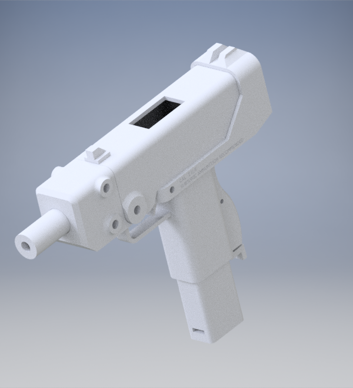
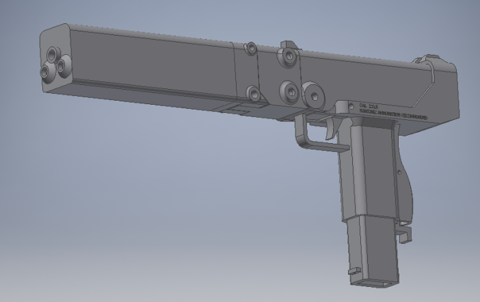

# 22lr personal defense weapon
Designed by *HulkHoganHH* ([steamcommunity.com/id/HulkHoganHH](steamcommunity.com/id/HulkHoganHH), discord:HulkHoganHH#3508, [thehulksterHH@gmail.com](thehulksterHH@gmail.com))

**Always check current releases before downloading for important information**

- **Open source**, make changes you see fit
- Designed, **not yet tested**.
- Intermediate hand tool skills may be required
- All parts made with AutoDesk inventor 2019
- Instructions to convert inventor files to .stl files at bottom

**I take no responsibility for any criminal activity committed with these files and will deny any involvement with any criminal parties. This is a fully automatic machine gun. Do not manufacture without a proper license. any trouble you get into is your fault.**

Recommended you use a higher quality 3d printer that is PETG or ABS or better compatible with about 8 inches minimum on each side for the most printing room. PLA is suitable for some parts due to the low caliber.

## Materials
(most can be found from your local hardware store, measured diameter):
- 1/8 steel bar stock
- 1/4 steel bar stock
- a nail (however for the firing pin this can be a piece of sharpened or filed steel bar stock)
- 3/16 steel bar stock
- 5/16 outer diameter (1/4 inner diameter) steel brake line (if you have 5/16 OD .22lr rifled liner liner and a chamber reamer that will work better)
  - alternatively, 8mm ODx6mm ID steel tube will awork better if you have access to it
- springs (you can either make your own from appropriate music wire or buy what you can)

## Recommended Tools
- file set
- drills corresponding with proper holes and stock
- dremel (*highly* recommended for sanding and cutting)
- JB weld or epoxy of your choosing
- a work vise
- a higher quality 3d printer (not designed with a cheap printer)

How you print these files is up to you, I have not followed printing instructions in the past of many files yet i have had success in the past. Do keep in mind however that layer separation can occur on stress bearing parts so print accordingly.

## Printing
To convert inventor parts to .stl format for 3d printing, open up the part and then go to environments > 3d print > begin 3d print (additive). to save as an STL, then go to 3d print > print > save copy as STL. before saving, go to options and set resolution to high. in the 3d printing software, part may show up as incorrect scale. change scale to either 10 or 25.4, depending on what software you use

## Other Tips
You shouldn't need instructions for assembly because it is only about twenty parts. If you can't assemble a gun that is only twenty parts then you shouldn't be a gun owner. However, for the trigger assembly there are **two required springs**. Between the lower face on the trigger and the upper inside face of the sear, take a small coil about 1/4 (about one full revolution of a helix of spring) of a 3/8" or similar size spring and heat it up with a lighter and burn it into the part so about two thirds sticks out. 

For trigger reset, insert a stiffer spring less than half an inch in length in between the grip and back of the trigger. You may also heat up one end of the spring and melt it into the grip to ensure it stays into the grip if you want.

Upper assembly uses 1/4" pins and may require drilling. Lower receiver also requires 1/4" pin for takedown pin hole and 3/16" pins for trigger and sear, which may also require drilling.

Housing for magazine release and the magazine release both use a 1/8" pin and an appropriately sized spring in between the housing and catch

Magazine spring will have to be either sourced from another pre existing magazine or made from scratch. How you go about this is up to you

The barrel is designed to have an insert and is sized for a 5/16" outer diameter liner. To insert the liner, ream the barrel through both ends with a 5/16" drill and then pound the insert in with a brass (or similar non steel) hammer while taking care not to bend or break the liner.
